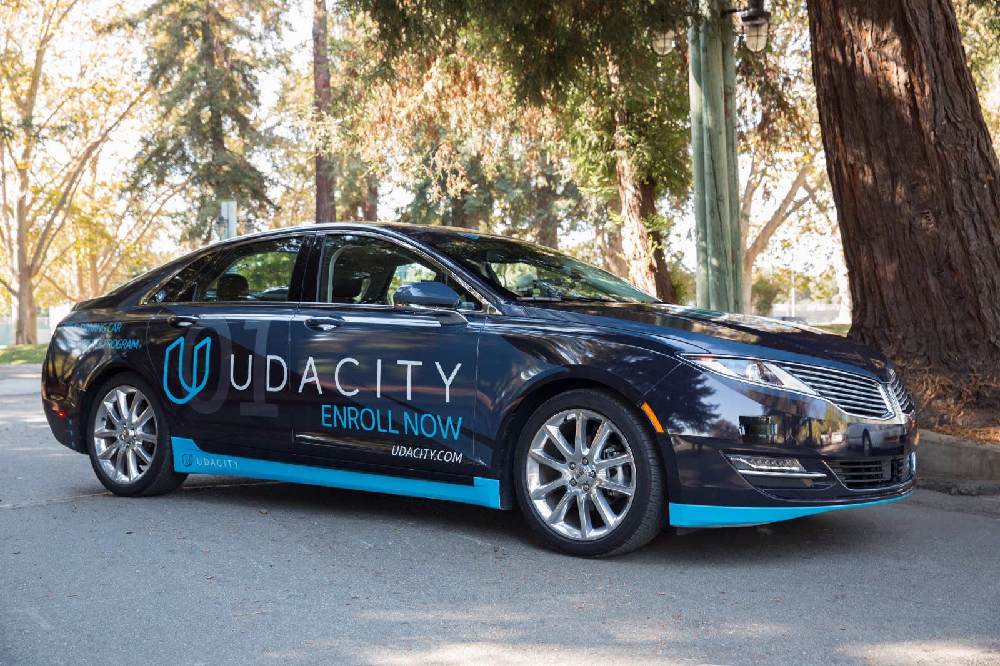
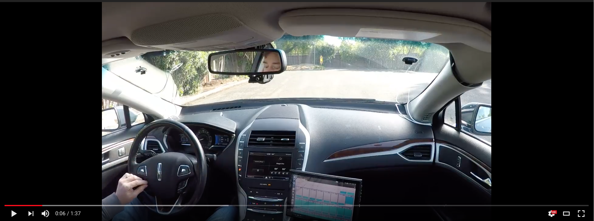
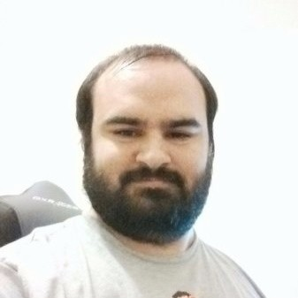
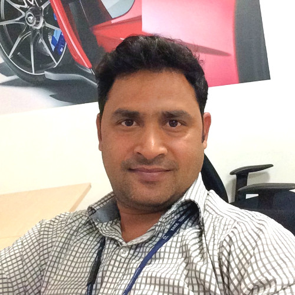
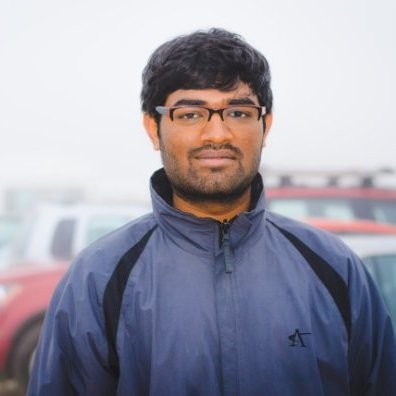
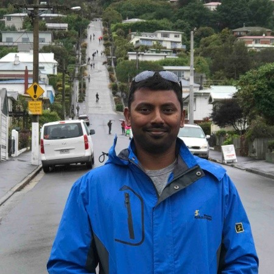

This is the project repo for the final project of the Udacity Self-Driving Car Nanodegree: Programming a Real Self-Driving Car. For more information about the project, see the project introduction [here](https://classroom.udacity.com/nanodegrees/nd013/parts/6047fe34-d93c-4f50-8336-b70ef10cb4b2/modules/e1a23b06-329a-4684-a717-ad476f0d8dff/lessons/462c933d-9f24-42d3-8bdc-a08a5fc866e4/concepts/5ab4b122-83e6-436d-850f-9f4d26627fd9).


 :vertical_traffic_light: :car:

### Project
In this project, we program a real self-driving car to drive on a parking lot and stop on red lights.


To drive on the parking lot, we first test our implementation on two separate simulators.
* The first simulator is a highway simulator.
Here is the video of the results here : ###VIDEO

* The second simulator is the same as the parking lot but played with rosbag.
Here is the video of the results here : ###VIDEO


Finally, we are able to drive the car around the parking lot :
Video here : ###VIDEO

[](https://youtu.be/13VhwfG965Q)


### Team

The team who built this project is a team of five engineers that met during Term 1, helping eachothers on understanding Convolutional Neural Networks, Computer Vision, and Robotics.
We finally decided to team up at the beginning of Term 3 and to call ourselves : __The Racers__

|     Name      | Image        | Location | LinkedIn | Github                   |
|---------------|--------------|----------|----------|--------------------------|
| __Vincent Wiart__ | | FRANCE | [linkedin.com/in/vwiart](https://linkedin.com/in/vwiart) |[github.com/vwiart](https://github.com/vwiart)  |
| __Anil Dhole__ |  | INDIA | [linkedin.com/in/anil-dhole](https://linkedin.com/in/anil-dhole)  | [github.com/ajdhole](https://github.com/ajdhole) |
| __Jeremy Cohen__ |    | FRANCE | [linkedin.com/in/jeremycohen2626](https://linkedin.com/in/jeremycohen2626)|[github.com/Jeremy26](https://github.com/Jeremy26)|
| __Anurag Kankanala__ | | INDIA | [linkedin.com/in/anurag-kankanala](https://linkedin.com/in/anurag-kankanala)|[github.com/anuragkankanala](https://github.com/anuragkankanala)|
| __Srikanth Mutyala__ |  | USA | [linkedin.com/in/srikanth-mutyala-a0a30546](https://linkedin.com/in/srikanth-mutyala-a0a30546) |[github.com/srimutyala](https://github.com/srimutyala)|

### Architecture


The project runs with [ROS](http://www.ros.org/) and is divided into the following modules :
 - `tl_detector` uses the camera to detect the traffic lights' color
 - `twist_controller` handles the control of the car
 - `waypoint_follower` makes sure the car follow the trajectory
 - `waypoint_loader` loads the route the car is going to follow
 - `waypoint_updater` adapts the car's route to the situation (eg. traffic light)
 
 
Please use **one** of the two installation options, either native **or** docker installation.

### Native Installation

* Be sure that your workstation is running Ubuntu 16.04 Xenial Xerus or Ubuntu 14.04 Trusty Tahir. [Ubuntu downloads can be found here](https://www.ubuntu.com/download/desktop).
* If using a Virtual Machine to install Ubuntu, use the following configuration as minimum:
  * 2 CPU
  * 2 GB system memory
  * 25 GB of free hard drive space

  The Udacity provided virtual machine has ROS and Dataspeed DBW already installed, so you can skip the next two steps if you are using this.

* Follow these instructions to install ROS
  * [ROS Kinetic](http://wiki.ros.org/kinetic/Installation/Ubuntu) if you have Ubuntu 16.04.
  * [ROS Indigo](http://wiki.ros.org/indigo/Installation/Ubuntu) if you have Ubuntu 14.04.
* [Dataspeed DBW](https://bitbucket.org/DataspeedInc/dbw_mkz_ros)
  * Use this option to install the SDK on a workstation that already has ROS installed: [One Line SDK Install (binary)](https://bitbucket.org/DataspeedInc/dbw_mkz_ros/src/81e63fcc335d7b64139d7482017d6a97b405e250/ROS_SETUP.md?fileviewer=file-view-default)
* Download the [Udacity Simulator](https://github.com/udacity/CarND-Capstone/releases).

### Docker Installation
[Install Docker](https://docs.docker.com/engine/installation/)

The preferred method to run the project is to use docker, as it make sure every dependencies are properly installed. The following commands can be used to run the docker image:
 - `run.sh` on linux or OSX
 - `run.bat` on Windows

Alternatively, the following commands can be used to build and run the containers:

1. Create the volume used in the container
`docker volume create sdcnd-capstone-volume`

2. Build the container
Be sure to replace or set `$SDC_CAPSTONE_IMAGE` to a proper name `docker build -f Dockerfile.builder -t $SDC_CAPSTONE_IMAGE .`

3. Run the container
Be sure to replace or set `$SDC_CAPSTONE_IMAGE` to a proper name
```
docker run --rm -it \
    -p 4567:4567 \
    -v sdcnd-capstone-volume:/app/ros \
    -v $(pwd)/ros/src:/app/ros/src:ro \
    -v $(pwd)/ros/launch:/app/ros/launch:ro \
    -v $(pwd)/data:/app/data \
    -v $(pwd)/resources/run.sh:/app/run.sh:ro \
    --name sdcnd-capstone-runner \
    $SDC_CAPSTONE_IMAGE /bin/bash
```

4. Run the simulator

### Port Forwarding
To set up port forwarding, please refer to the [instructions from term 2](https://classroom.udacity.com/nanodegrees/nd013/parts/40f38239-66b6-46ec-ae68-03afd8a601c8/modules/0949fca6-b379-42af-a919-ee50aa304e6a/lessons/f758c44c-5e40-4e01-93b5-1a82aa4e044f/concepts/16cf4a78-4fc7-49e1-8621-3450ca938b77)

### Usage

1. Clone the project repository
```bash
git clone https://github.com/udacity/CarND-Capstone.git
```

2. Install python dependencies
```bash
cd CarND-Capstone
pip install -r requirements.txt
```
3. Make and run styx
```bash
cd ros
catkin_make
source devel/setup.sh
roslaunch launch/styx.launch
```
4. Run the simulator

### Real world testing
1. Download [training bag](https://s3-us-west-1.amazonaws.com/udacity-selfdrivingcar/traffic_light_bag_file.zip) that was recorded on the Udacity self-driving car.
2. Unzip the file
```bash
unzip traffic_light_bag_file.zip
```
3. Play the bag file
```bash
rosbag play -l traffic_light_bag_file/traffic_light_training.bag
```
4. Launch your project in site mode
```bash
cd CarND-Capstone/ros
roslaunch launch/site.launch
```
5. Confirm that traffic light detection works on real life images

